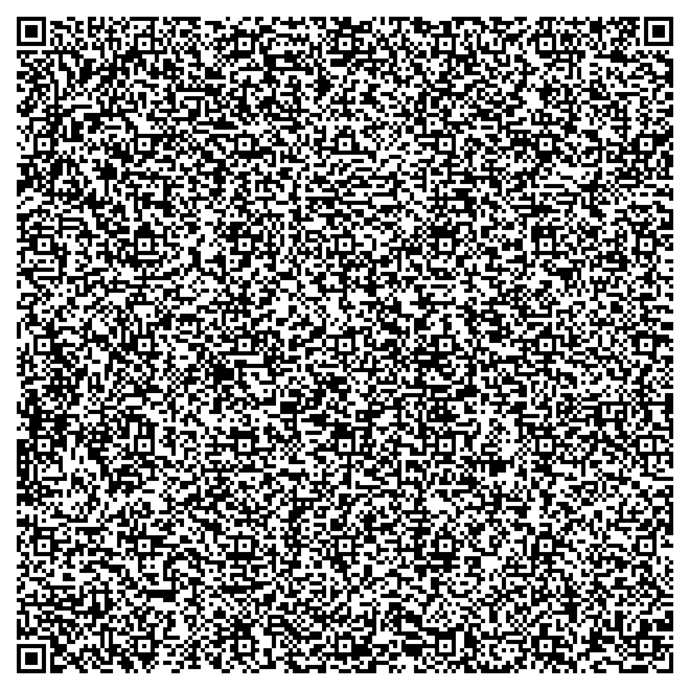

# QR-Calculator 🧮✨

A calculator app stored in a QR code! 🖼️📱 This project demonstrates how you can embed an application within a QR code for easy sharing and use. 🎉

## How It Works 🛠️
1. 📷 **Scan the QR code** to access the calculator app.
2. 💻 **Use the app directly** in your browser.
3. 🔢 Enjoy performing calculations effortlessly! 🚀

### QR Code 🎯
Here’s the QR code for the calculator app:

## Files 📂
- **`main.py`** 🐍: The Python script that generates the QR code.
- **`index.html`** 🌐: The calculator app stored in the QR code.
- **`qr_code.png`** 🖼️: The QR code image.
- **`README.md`** 📜: Documentation for the project. (This is it!)
- **`LICENSE`** ⚖️: Project licensing information.

## License 🔓
This project is licensed under the MIT License. 🛡️
